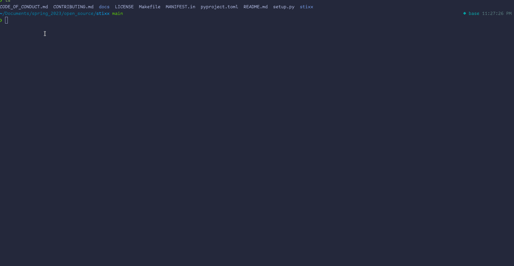

<!--.. stixx documentation master file, created by
   sphinx-quickstart on Tue Apr  4 20:47:03 2023.
   You can adapt this file completely to your liking, but it should at least
   contain the root `toctree` directive.
-->

# Stixx Documentation

# Installation
```bash
pip install stixx
```

# Running
  - Locate the directory
```bash
$ pip show stixx | grep "Location"
```
  - Once the location has been found change directories to said location
  ```bash
  $ cd <location>
  ```
  -  Run the game
```bash
$ python game.py
```

# Demo



```eval_rst
.. Path Notes::
    - You can now see your hand and opponent's hand if you accidentally
      misclick on either "l" or "r".
    - Unittests have been updated as well.
```

<!--
.. toctree::
   :maxdepth: 2
   :caption: Contents:
-->

<!-- Indices and tables
==================

* :ref:`genindex`
* :ref:`modindex`
* :ref:`search`
-->
